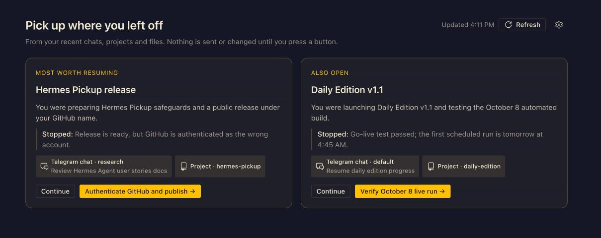

# Hermes Pickup

"Pick up where you left off" for Hermes Desktop: 1 to 10 cards of unfinished work (5 by default), each
with a title, what you were doing, where it stopped, and a suggested next step. Built from your recent
Hermes chats, project folders and files.

The page has a **Cards | Settings** switch. Settings holds the number of cards, how many chats are read
per profile and in total, the look-back days for chats, projects and files, a tick-list of profiles
(all included; untick one and it is never read), the exclude list and files toggle, and your project
folders (empty = auto-detect). Save sends only what you changed, shows a refused value next to its field,
and does not refresh; changes apply to the next refresh and your current cards stay until it succeeds.
More cards and more chats mean a bigger request to your model (more tokens, a few more seconds).

MIT licensed. The evidence builder, transcript reader, cited-id parser and prompt are adapted from
[Herald OS](https://github.com/iamlukethedev/Herald-OS) by Luke [iamlukethedev](https://github.com/iamlukethedev), MIT. See `LICENSE`
and `reference/`.



## Install / uninstall

```sh
./install.sh                      # into ${HERMES_HOME:-$HOME/.hermes}
HERMES_HOME=/tmp/try ./install.sh # somewhere harmless
./uninstall.sh
```

- Copies a file only when its content differs, and says what it did (`installed`, `updated`, `=` unchanged).
- Adds `hermes-pickup` to `plugins.enabled` in `config.yaml` only if it is not there. The file is parsed
  with PyYAML (Hermes's own python is tried first, then `python3`; set `HERMES_PYTHON` to override), edited
  line by line so comments and other values survive, re-parsed, and written only if the result is exactly the
  intended data. Block lists, flow lists (including `[]`) and `plugins: {}` are handled; anything else aborts
  with the manual instruction rather than guessing. Files are copied before the config edit, so if the edit
  fails the installer says that the files were copied, config.yaml was not changed and the plugin is not enabled
  (it exits 2). Uninstall edits the config first and removes no files if that fails.
- `desktop/plugin.js` is copied to `desktop-plugins/hermes-pickup/` when it exists (the UI is a separate step).
- Uninstall removes only those files and the `plugins.enabled` entry. Your data in `$HERMES_HOME/pickup/` stays.
- Restart Hermes Desktop once after installing so the backend mounts. Authentication is Hermes's: the router
  is mounted by the dashboard host at `/api/plugins/hermes-pickup/`; there is no standalone server.

### Multi-profile installs (Hermes bug #134712)

On a Hermes with more than one profile, a known Hermes bug
([NousResearch/hermes-agent#134712](https://github.com/NousResearch/hermes-agent/issues/134712)) can make the
Desktop backend read another profile's `plugins.enabled` after startup. A plugin enabled only in the default
profile then answers `Plugin not found`. Two safeguards:

- `install.sh` notices the other profiles and asks whether to enable `hermes-pickup` in each of them too
  (`PICKUP_ALL_PROFILES=1` says yes without asking, `=0` says no; with no terminal it says no). It records each
  edit separately, and `uninstall.sh` undoes exactly those, leaving any profile where you had enabled it yourself.
- The Pick up page recognises `Plugin not found` and explains the bug and the fix instead of a bare error. This
  also covers installs that did not use `install.sh`, such as `hermes plugins install`.

The installer also warns when `HERMES_HOME` points at a profile folder (as it does in a terminal opened inside
Hermes), since it would then install for that profile only.

## Privacy and safety

- **No model call without consent.** To write the cards, each Refresh sends the following evidence to your
  configured Hermes model provider:
  - Recent chat excerpts (titles, user messages, the last reply and unfinished steps) and chat metadata:
    profile and source labels, timestamps, message counts, interrupted or stopped status, and associated projects.
  - Project and file names and paths, plus when they were changed or opened.
  - Git branch and status information, including changed file names and paths, and recent commit messages
    (subjects), dates and whether a commit was made by an agent.

  Document and file contents are never read. You can review exclusions in settings before turning on Pickup.
  `POST /refresh` returns 409 until `POST /consent` was called. A corrupt settings
  file, or persisted settings that no longer validate, count as no consent (`PUT /settings` does not revive it;
  call `POST /consent` again). A refresh uses the settings snapshot taken when it passed the consent check.
- Read-only toward your data: session stores opened `mode=ro`, git with `--no-optional-locks`, file contents never read.
- The plugin writes only `$HERMES_HOME/pickup/` (profile-scoped, via Hermes's `get_hermes_home()`):
  `settings.json` (consent and settings) and `cache.json` (cards, counts, timestamp: never the raw evidence or the
  model's answer). Writes are atomic.
- A refresh that fails (model error, unreadable answer, unreadable stores) keeps the previous cache.
- Only one refresh runs at a time per profile state folder in the host process; a request arriving during
  one waits for it and gets the same result. Separate server processes do not share this in-memory lock.
- Settings changes apply to the next refresh; existing cached cards are retained until it succeeds.
- There is no revoke endpoint yet. Removing `pickup/settings.json` revokes consent; uninstall deliberately
  preserves it along with the cache. Back up that folder before any manual deletion.

### Default exclusions

Until you change them, folders, chat titles and your own messages containing any of
`health`, `medical`, `finance`, `nutrition`, `inbox` are left out. All profiles are included by default,
regardless of their names, until you untick one under Settings → Profiles; a skipped profile is never
opened. The backend `exclude_profiles` field defaults to `[]`, and saved values are preserved, including
during partial settings updates.
Setting `exclude` or `exclude_profiles` replaces that field; `[]` means no exclusions. These are keyword
filters, not a sensitive-data classifier: review the folder/word list before turning on Pickup. Including
all profiles does not bypass that list or the consent gate. The package cannot infer which
employer/project names are private.

## API

Base: `/api/plugins/hermes-pickup`. Errors are `{"detail": "..."}` (422 validation errors carry a list of
`{"field", "message"}`). Timestamps are Unix seconds (float).

**Card**
```json
{"title": "Landing page", "summary": "You were …", "stopped": "…",
 "next": {"label": "Add pricing", "prompt": "…"},
 "items": [{"kind": "chat|project|file|folder", "ref": "<session id or path>", "label": "…",
            "profile": "…", "source": "…"}]}
```
`next` may be `null`. `profile`/`source` appear on chat items only. For a chat, `ref` is the session id and
`profile` is the profile that owns it.

| Endpoint | Response |
|---|---|
| `GET /status` | `{consent: {given, at}, last_run, counts, refreshing, settings, available_profiles, state_error}` |
| `POST /consent` body `{"accepted": true}` | `{consent: {given, at}}` (idempotent; `false` → 422) |
| `POST /refresh` | `{cards, made_at, counts}`; 409 without consent; 502 model failed or answer unusable; 500 data unreadable |
| `GET /cards` | `{cards, made_at, counts}`, no model call; `{cards: [], made_at: null, counts: null}` before the first run |
| `GET /settings` | `{settings, defaults, available_profiles}` |
| `PUT /settings` | partial update, same response as GET; unknown keys (including `consent`) → 422 |

`counts`: `{chats, projects, files, profiles: [names used], source_errors}`. `state_error` is true when
`settings.json` was unreadable (consent is then treated as not given).
`available_profiles`: every profile in this install, including those without a session store. The Settings page builds its
profile tick-list from `GET /profiles` (`{profiles: [{name, excluded, has_session_store}]}`) instead.

### Settings

| Field | Type / range | Default |
|---|---|---|
| `file_window_days`, `project_window_days`, `chat_window_days` | number, 0 < n ≤ 365 | 3, 7, 3 |
| `max_files` | int 0–50 | 16 |
| `max_projects` | int 1–20 | 8 |
| `max_chats` | int 1–40 | 20 |
| `max_cards` | int 1–10 | 5 |
| `chats_per_profile` | int 1–10 | 3 |
| `chats_read` | int 1–100 | 24 |
| `include_files` | bool | true |
| `project_roots` | ≤100 absolute or `~/` paths; empty = auto-detect | `[]` |
| `exclude` | ≤100 folders (`/…`, `~/…`) or words | see above |
| `exclude_profiles` | ≤100 profile names (Settings → Profiles) | `[]` (all profiles) |
| `skip_sessions` | ≤100 session ids | `[]` |
| `agent_identities` | ≤100 extra commit-author strings treated as bots | `[]` |

Types are strict (no `true` for a number, no strings for lists, no NaN/Infinity, no `null`); strings ≤ 500 chars
without control characters; lists are trimmed and de-duplicated.

## Tests

```sh
<hermes venv python> -m pytest tests          # backend, installer round trips, multi-profile safeguard
node desktop/test/check-imports.mjs           # SDK-only imports, no colour literals
node desktop/test/pickup.test.mjs --modules=<node_modules with react, react-dom, esbuild, playwright>
```
Everything runs against a temporary `HERMES_HOME`/`HOME` and a fake model; nothing touches your real Hermes.

## Layout

```
plugin.yaml  __init__.py  LICENSE
dashboard/   manifest.json  plugin_api.py   (+ pickup_core.py, copied from core/ by the installer)
core/        pickup_core.py                 the engine (do not edit for the backend)
desktop/     plugin.js  README.md  test/    the Desktop page (see desktop/README.md)
scripts/     common.sh  config_edit.py      installer helpers
```
